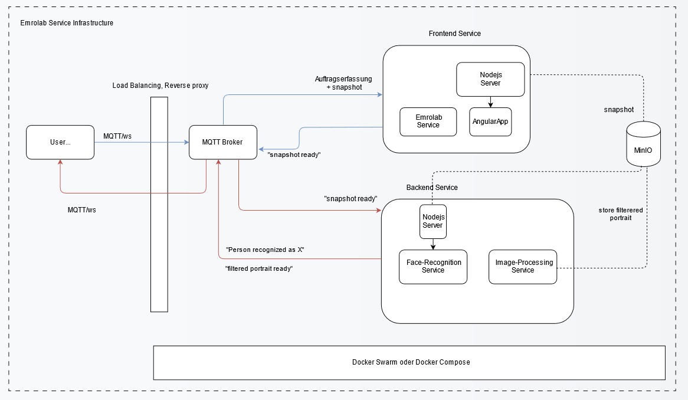

Architektur
====================

Die erste Schnittstelle ist der MQTT Broker. An bestimmten topics lauschen die Dienste auf eingehende Anfragen. MinIO wird als File Storage für unsere Bilder benutzt. Diese sind 
Service-übergreifend, sodass jeder Service auf diese Dateien zugreifen kann. Alle Dienste werden über Docker Compose orchestriert, welches aber auch
durch Docker Swarm einfach ersetzt werden kann. Unser Technologie Stack besteht aus:

* Mqttjs
* Nodejs
* MinIO
* Docker
* face-api.js

.. image:: ../_static/images/mqtt.png
   :width: 300